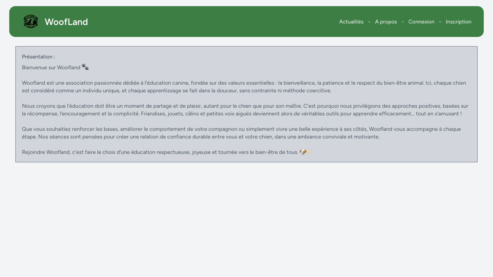
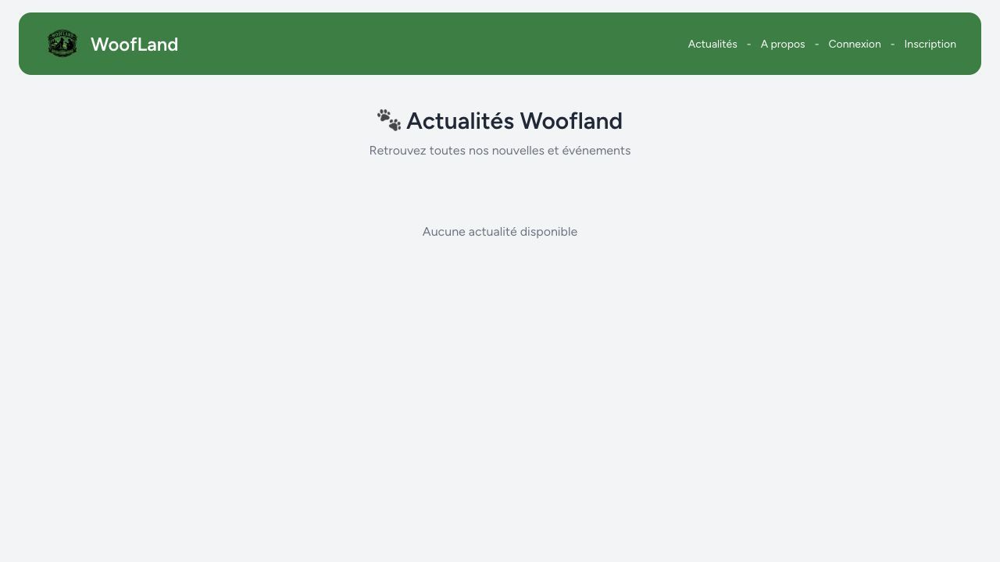
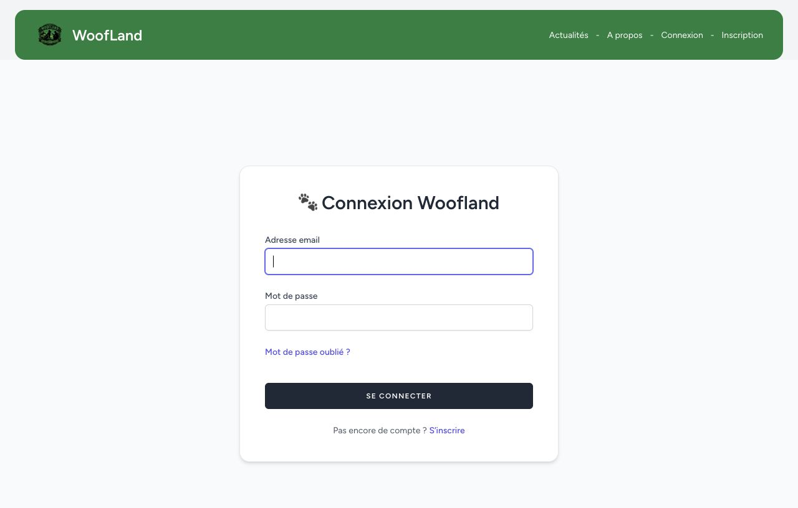
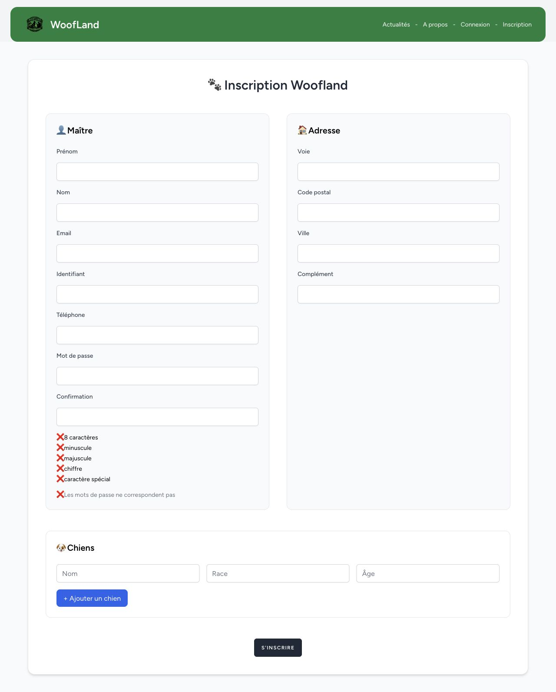

# Dossier professionnel CDA - Projet Woofland

Projet support : Woofland Website, site web Laravel pour l'association Woofland La Sentinelle.

Technologies principales : Laravel 12, PHP 8.2+, Blade, Tailwind CSS, Vite, Alpine.js, MySQL, Eloquent ORM, PHPUnit, GitHub Actions, SonarQube.

## Structure retenue et correspondance avec le referentiel CDA

Ce dossier utilise le projet Woofland comme fil conducteur unique. Chaque exemple est associe a une ou plusieurs competences du referentiel CDA afin que le jury puisse faire facilement le lien entre la competence attendue et une realisation concrete du projet.

### Activite-type 1 - Developper une application securisee

1. Installation et configuration de l'environnement de developpement Laravel : installer/configurer son environnement de travail et contribuer au projet.
2. Developpement des interfaces utilisateur de Woofland : developper des interfaces utilisateur.
3. Developpement des composants metier et fonctionnalites applicatives : developper des composants metier.
4. Gestion collaborative du projet et securisation de l'application : contribuer a la gestion d'un projet informatique et securiser l'application.

### Activite-type 2 - Concevoir et developper une application securisee organisee en couches

1. Analyse des besoins et maquettage de l'application : analyser les besoins et maquetter l'application.
2. Definition de l'architecture logicielle Laravel MVC : definir l'architecture logicielle.
3. Conception et mise en place de la base de donnees relationnelle : concevoir et mettre en place une base de donnees relationnelle.
4. Developpement des acces aux donnees avec Eloquent ORM et SQL : developper des composants d'acces aux donnees SQL.

### Activite-type 3 - Preparer le deploiement d'une application securisee

1. Preparation et execution des tests de l'application : preparer et executer les plans de tests.
2. Documentation et preparation du deploiement : preparer et documenter le deploiement.
3. Mise en production et demarche DevOps avec GitHub Actions : contribuer a la mise en production dans une demarche DevOps.

## Activite-type 1 - Developper une application securisee

### Exemple 1 - Installation et configuration de l'environnement de developpement Laravel

**Competences du referentiel couvertes**

- Installer et configurer son environnement de travail.
- Contribuer a la gestion d'un projet informatique.

**1. Taches ou operations effectuees, et conditions**

J'ai installe et configure l'environnement de developpement du projet Woofland afin de disposer d'une application Laravel fonctionnelle en local. Le projet etant une application web complete, j'ai d'abord verifie les pre-requis techniques : version de PHP compatible avec Laravel, presence de Composer pour les dependances back-end, presence de Node.js/npm pour les dependances front-end, et disponibilite d'une base de donnees MySQL.

J'ai ensuite recupere le projet depuis GitHub, puis je me suis place dans le dossier de travail du projet. J'ai installe les dependances PHP declarees dans `composer.json`, notamment Laravel, Laravel Breeze, PHPUnit, Laravel Pint et les paquets necessaires au fonctionnement de l'application. Cette etape m'a permis de generer le dossier `vendor` et l'autoload Composer utilise par Laravel.

Commande utilisee :

```bash
composer install
```

J'ai ensuite installe les dependances front-end declarees dans `package.json`, comme Vite, Tailwind CSS, Alpine.js, Axios et le plugin Laravel Vite. Ces outils sont necessaires pour compiler les fichiers CSS et JavaScript utilises par les vues Blade.

Commande utilisee :

```bash
npm install
```

J'ai prepare le fichier d'environnement de l'application a partir du modele fourni. Ce fichier permet de definir les informations propres a l'environnement local : nom de l'application, URL locale, configuration de la base de donnees, driver de session, cache et autres variables sensibles. J'ai ensuite genere la cle applicative Laravel, indispensable pour le chiffrement et la securisation de certaines donnees de l'application.

Commandes utilisees :

```bash
cp .env.example .env
php artisan key:generate
```

J'ai configure la connexion a la base de donnees dans le fichier `.env`, en renseignant le type de base, l'hote, le port, le nom de la base, l'utilisateur et le mot de passe. Une fois cette configuration realisee, j'ai execute les migrations Laravel afin de creer les tables necessaires au projet : utilisateurs, adresses, chiens, cours, inscriptions, publications, adhesions, sessions, cache et jobs.

Commande utilisee :

```bash
php artisan migrate
```

Lorsque des donnees de demonstration etaient necessaires pour tester l'affichage et les parcours utilisateur, j'ai utilise les seeders du projet, notamment pour alimenter les cours et les publications.

Commande possible :

```bash
php artisan db:seed
```

J'ai enfin lance l'application en local afin de verifier que le back-end Laravel et le front-end Vite fonctionnaient ensemble. Le projet contient un script Composer qui permet de lancer simultanement le serveur Laravel, l'ecoute de la file d'attente et le serveur Vite. Cela m'a permis de travailler dans des conditions proches d'un developpement reel, avec recompilation automatique des ressources front-end.

Commande utilisee :

```bash
composer dev
```

En complement, j'ai verifie que les assets front-end pouvaient etre compiles pour un usage hors mode developpement.

Commande utilisee :

```bash
npm run build
```

Apres ces operations, j'ai controle le bon fonctionnement de l'application dans le navigateur : affichage de la page d'accueil, chargement des styles Tailwind, navigation vers les pages publiques, acces aux formulaires d'inscription et de connexion, puis verification des pages protegees apres authentification.

Captures a integrer dans le dossier :

- Capture du terminal apres `composer install` ou du fichier `composer.json`.
- Capture du terminal apres `npm install` ou du fichier `package.json`.
- Capture du fichier `.env.example` pour montrer les variables d'environnement attendues, sans afficher de secrets reels.
- Capture du terminal apres `php artisan migrate`.
- Capture du fichier `vite.config.js` ou du script `npm run build`.
- Capture de la page d'accueil Woofland ouverte en local.
- Capture d'une page avec styles charges, par exemple les actualites ou le formulaire de connexion.

**2. Moyens utilises**

Composer, npm, Laravel Artisan, fichier `.env`, migrations Laravel, Vite, Tailwind CSS, MySQL, Git/GitHub.

Preuves possibles : capture de `composer.json`, `package.json`, `.env.example`, terminal apres migration, navigateur affichant la page d'accueil.

**3. Avec qui avez-vous travaille ?**

J'ai travaille principalement en autonomie, avec l'appui de la documentation Laravel, des ressources de formation CDA et des retours eventuels du formateur ou des pairs.

**4. Contexte**

Le projet consiste a developper le site officiel de l'association Woofland La Sentinelle. L'environnement devait permettre de travailler sur les fonctionnalites membres, administrateur, publications, cours, messagerie et securite.

**5. Informations complementaires**

Le projet contient un script `composer dev` permettant de lancer simultanement le serveur Laravel, la file d'attente et Vite.

### Exemple 2 - Developpement des interfaces utilisateur de Woofland

**Competences du referentiel couvertes**

- Developper des interfaces utilisateur.
- Produire des interfaces exploitables par les visiteurs, les membres et les administrateurs.

**1. Taches ou operations effectuees, et conditions**

J'ai developpe les interfaces utilisateur publiques et connectees de l'application Woofland dans un environnement Laravel local. L'objectif etait de transformer les besoins fonctionnels de l'association en ecrans utilisables par trois types d'utilisateurs : les visiteurs, les membres connectes et les administrateurs. J'ai donc travaille a la fois sur l'affichage, l'organisation des pages, la navigation, les formulaires et la coherence visuelle generale.

J'ai commence par identifier les pages necessaires selon les profils utilisateurs. Pour un visiteur, l'application devait permettre de comprendre l'activite de l'association, consulter les actualites et acceder a l'inscription ou la connexion. Pour un membre connecte, l'interface devait donner acces au tableau de bord, au profil, aux chiens, aux cours et a la messagerie. Pour l'administrateur, l'interface devait permettre d'acceder rapidement au tableau de bord, a la gestion des utilisateurs et a la gestion des publications.

J'ai ensuite organise les vues selon ces espaces afin de ne pas melanger les interfaces publiques, les interfaces membres et les interfaces d'administration. Cette organisation m'a permis de travailler plus clairement et de garder une structure de projet maintenable.

Organisation des vues :

```text
resources/views/
resources/views/auth/
resources/views/profile/
resources/views/publications/
resources/views/cours/
resources/views/messages/
resources/views/admin/
resources/views/layouts/
resources/views/components/
```

J'ai cree et adapte les vues Blade de la page d'accueil, de la page "a propos", de la liste des actualites, du detail d'une publication, de l'inscription, de la connexion, du tableau de bord membre, du profil, des cours, de la messagerie et de l'administration. J'ai utilise les layouts Laravel pour eviter de dupliquer la structure HTML generale, la navigation et les elements communs.

Pour la page d'accueil, j'ai mis en avant l'identite visuelle de Woofland, la navigation principale et les publications recentes afin que le visiteur comprenne rapidement le but du site. Pour la page des actualites, j'ai prevu un affichage sous forme de liste/cartes de publications, avec un lien vers le detail de chaque publication. Pour les pages d'authentification, j'ai travaille sur des formulaires lisibles et coherents avec le reste du site.

Pour l'inscription, j'ai integre un formulaire plus complet qu'un simple formulaire de compte. Il permet de saisir les informations du membre, son adresse et les informations relatives a son chien. Cette interface devait rester comprehensible malgre le nombre de champs. J'ai donc regroupe les informations par blocs logiques et prevu l'affichage des erreurs de validation renvoyees par Laravel.

Pour l'espace membre, j'ai developpe une interface de profil permettant de retrouver les informations personnelles, l'adresse, le mot de passe, l'adhesion et les chiens rattaches au compte. J'ai aussi travaille sur la page des cours, qui devait afficher les cours disponibles, les filtres, les informations utiles et les actions d'inscription ou de desinscription. Pour la messagerie, j'ai separe la liste des conversations et le detail d'une conversation afin de faciliter la lecture.

Pour l'espace administrateur, j'ai utilise un layout specifique afin de differencier clairement l'administration du reste du site. Les pages admin sont reservees aux utilisateurs autorises et servent a gerer les donnees developpees dans le projet : utilisateurs, roles et publications. Le dashboard administrateur affiche egalement des indicateurs lies aux utilisateurs, aux cours et aux publications.

Fichiers concernes :

```text
resources/views/welcome.blade.php
resources/views/about.blade.php
resources/views/publications/index.blade.php
resources/views/publications/show.blade.php
resources/views/cours/index.blade.php
resources/views/profile/edit.blade.php
resources/views/messages/index.blade.php
resources/views/messages/show.blade.php
resources/views/admin/dashboard.blade.php
resources/views/layouts/app.blade.php
resources/views/layouts/admin.blade.php
resources/views/layouts/guest.blade.php
```

J'ai egalement reutilise des composants Blade pour uniformiser les boutons, champs de formulaire, messages d'erreur, menus deroulants et cartes de publication. Cette organisation permet d'avoir une interface plus coherente et plus simple a maintenir.

Par exemple, au lieu de recreer un bouton ou un champ de saisie different dans chaque formulaire, j'ai utilise des composants communs. Cela permet de modifier un element partage a un seul endroit et de conserver une presentation homogene. Les composants de formulaire sont aussi importants pour la securite et la fiabilite, car ils facilitent l'affichage des erreurs de validation et l'utilisation des jetons CSRF dans les formulaires Laravel.

Fichiers de composants utiles :

```text
resources/views/components/primary-button.blade.php
resources/views/components/secondary-button.blade.php
resources/views/components/text-input.blade.php
resources/views/components/input-error.blade.php
resources/views/components/publication-card.blade.php
resources/views/components/nav-link.blade.php
```

Pour le style, j'ai utilise Tailwind CSS avec Vite. J'ai travaille directement dans les fichiers Blade en appliquant des classes utilitaires Tailwind pour gerer les espacements, couleurs, tailles, alignements, bordures, grilles et etats visuels. Cette methode m'a permis d'ajuster rapidement le rendu sans devoir creer une feuille CSS specifique pour chaque page.

J'ai aussi tenu compte des differents etats d'une interface : affichage normal, formulaire vide, erreurs de validation, message de succes, page sans donnees, utilisateur connecte ou non connecte. Par exemple, l'interface ne doit pas afficher les memes actions a un visiteur qu'a un membre connecte, et l'espace admin ne doit pas etre accessible depuis une navigation utilisateur classique.

Apres modification des vues ou des fichiers CSS, j'ai lance le serveur de developpement afin de verifier le rendu directement dans le navigateur. J'ai effectue des controles manuels sur les pages principales pour verifier que les styles etaient charges, que la navigation fonctionnait, que les formulaires etaient lisibles et que les messages d'erreur s'affichaient correctement.

Commandes utilisees :

```bash
npm run dev
php artisan serve
```

ou avec le script global du projet :

```bash
composer dev
```

J'ai egalement verifie que les ressources front-end pouvaient etre compilees pour un environnement hors developpement. Cette verification est importante, car une interface peut fonctionner en mode developpement mais poser probleme au moment du build si un fichier ou une dependance est mal reference.

Commande de verification :

```bash
npm run build
```

J'ai controle manuellement l'affichage sur plusieurs pages : navigation principale, affichage des publications, lisibilite des formulaires, messages de validation, affichage des boutons d'action, coherence entre l'espace membre et l'espace administrateur, et presence des elements attendus selon le profil utilisateur.

Les controles realises portaient notamment sur :

- La page d'accueil : logo, navigation, sections principales et publications recentes.
- La page actualites : affichage des publications, lisibilite des cartes et acces au detail.
- La page detail d'une publication : titre, contenu, image eventuelle et retour a la liste.
- La page inscription : organisation des champs, erreurs de validation et coherence du formulaire.
- La page connexion : lisibilite, lien vers l'inscription et affichage des erreurs.
- La page profil : separation des blocs d'informations personnelles, adresse, chien et mot de passe.
- La page cours : filtres, informations de cours, boutons d'inscription/desinscription.
- La messagerie : liste des conversations et affichage des messages.
- Le dashboard admin : separation avec l'espace membre, acces a la gestion des utilisateurs et acces a la gestion des publications.

Captures a integrer dans le dossier :

- Page d'accueil avec les publications recentes.
- Page actualites avec une liste de publications.
- Page de detail d'une publication.
- Page de connexion.
- Page d'inscription avec les champs utilisateur, adresse et chien.
- Page profil utilisateur.
- Page des cours avec filtres.
- Page messagerie.
- Dashboard administrateur.
- Capture du code d'un layout Blade et d'un composant reutilisable.

**2. Moyens utilises**

Blade, Tailwind CSS, Vite, composants Laravel, layouts `app`, `guest` et `admin`, formulaires Laravel, affichage des messages de validation et de session.

Preuves possibles : captures de la page d'accueil, des actualites, du profil, de la page des cours, de l'espace admin, et captures du code dans `resources/views`.

**3. Avec qui avez-vous travaille ?**

J'ai travaille en autonomie, en tenant compte du besoin utilisateur : proposer une interface claire pour les membres de l'association, les administrateurs et les visiteurs.

**4. Contexte**

Woofland devait etre utilisable par plusieurs profils : visiteurs, membres connectes, formateurs et administrateurs. Les interfaces devaient donc separer les actions publiques, les actions membres et les actions d'administration.

**5. Informations complementaires**

Les vues sont organisees dans `resources/views`, avec des composants reutilisables comme les boutons, champs de formulaire, menus et cartes de publication.

### Exemple 3 - Developpement des composants metier et fonctionnalites applicatives

**Competences du referentiel couvertes**

- Developper des composants metier.
- Traduire des regles fonctionnelles en traitements applicatifs Laravel.

**1. Taches ou operations effectuees, et conditions**

J'ai developpe les fonctionnalites metier principales de l'application Woofland a partir des besoins de l'association. L'objectif etait de permettre a un visiteur de consulter les informations publiques, puis a un membre connecte de gerer son profil, ses chiens, ses inscriptions aux cours et ses messages.

J'ai mis en place le parcours d'inscription d'un utilisateur. Lors de la creation du compte, l'application enregistre les informations personnelles, l'adresse, le telephone et au moins un chien associe au compte. La validation Laravel controle les champs obligatoires, le format de l'email, l'unicite du nom d'utilisateur et de l'email, le code postal et la robustesse du mot de passe.

Fichier concerne :

```text
app/Http/Controllers/Auth/RegisteredUserController.php
```

J'ai ensuite developpe la gestion du profil. Un utilisateur connecte peut modifier ses informations, son adresse, ajouter un chien, modifier un chien existant ou supprimer un chien. Les operations sur les chiens sont protegees : un utilisateur ne recupere que les chiens rattaches a son propre compte.

Fichiers concernes :

```text
app/Http/Controllers/ProfileController.php
resources/views/profile/edit.blade.php
resources/views/profile/partials/update-profile-information-form.blade.php
resources/views/profile/partials/update-address-form.blade.php
resources/views/profile/partials/update-dog-form.blade.php
```

J'ai developpe la fonctionnalite de consultation des cours. L'utilisateur peut filtrer les cours selon le type, le terrain ou la date. Les cours sont tries par date et heure de debut, et seules les sessions futures sont affichees. J'ai egalement developpe l'inscription et la desinscription a un cours avec une regle metier : l'action est refusee lorsqu'il reste moins de six heures avant le debut du cours.

Fichier concerne :

```text
app/Http/Controllers/CoursController.php
```

J'ai developpe la consultation des publications : liste paginee des actualites, tri des plus recentes aux plus anciennes, affichage du detail d'une publication et relation avec l'utilisateur auteur.

Fichiers concernes :

```text
app/Http/Controllers/PublicationController.php
resources/views/publications/index.blade.php
resources/views/publications/show.blade.php
resources/views/components/publication-card.blade.php
```

J'ai egalement mis en place une messagerie entre utilisateurs. Les routes de messagerie sont protegees par authentification afin d'eviter qu'un visiteur non connecte puisse acceder aux conversations.

Fichiers concernes :

```text
app/Http/Controllers/MessageController.php
resources/views/messages/index.blade.php
resources/views/messages/show.blade.php
```

Captures a integrer dans le dossier :

- Formulaire d'inscription complet.
- Code de validation dans `RegisteredUserController`.
- Profil utilisateur avec modification de l'adresse.
- Gestion des chiens dans le profil.
- Page des cours avec filtres visibles.
- Code de la regle des six heures dans `CoursController`.
- Liste des publications et detail d'une publication.
- Messagerie utilisateur.

**2. Moyens utilises**

Controleurs Laravel, routes web, modeles Eloquent, relations entre modeles, validations de requetes, middleware d'authentification, vues Blade.

Preuves possibles : captures de `CoursController`, `ProfileController`, `RegisteredUserController`, page de cours avec filtres, formulaire de profil, formulaire d'inscription.

**3. Avec qui avez-vous travaille ?**

J'ai travaille en autonomie, avec validation fonctionnelle par tests et verification manuelle dans le navigateur.

**4. Contexte**

L'application devait repondre aux besoins d'une association canine : presenter les actualites, permettre aux membres de gerer leurs informations et leurs chiens, et faciliter l'inscription aux cours.

**5. Informations complementaires**

Les fonctionnalites sont structurees autour de modeles metier comme `User`, `Chien`, `Adresse`, `Cours`, `Publication` et `Adhesion`.

### Exemple 4 - Gestion collaborative du projet et securisation de l'application

**Competences du referentiel couvertes**

- Contribuer a la gestion d'un projet informatique.
- Securiser l'application.
- Mettre en place des controles d'acces, de validation et d'authentification.

**1. Taches ou operations effectuees, et conditions**

J'ai utilise Git et GitHub pour suivre l'evolution du projet, conserver un historique des modifications et travailler avec une methode proche d'un contexte professionnel. Chaque evolution peut etre associee a des fichiers modifies, des commits et des controles de fonctionnement.

Commandes utiles pour montrer la gestion du projet :

```bash
git status
git log --oneline --graph --decorate --all
git diff
```

Sur la securisation, j'ai mis en place plusieurs niveaux de protection. L'authentification Laravel protege les pages reservees aux membres, tandis que le middleware admin bloque l'acces a l'administration pour les utilisateurs qui n'ont pas le role `admin`.

Fichiers concernes :

```text
routes/web.php
app/Http/Middleware/IsAdmin.php
bootstrap/app.php
```

J'ai securise l'inscription avec des validations fortes. Le mot de passe doit respecter des contraintes de longueur, lettres, majuscules/minuscules, chiffres et symboles. Il est ensuite stocke avec un hash et non en clair dans la base de donnees.

Fichier concerne :

```text
app/Http/Controllers/Auth/RegisteredUserController.php
```

J'ai egalement utilise les protections natives de Laravel : jetons CSRF dans les formulaires, protection des routes par middleware, verification email, regeneration de session apres authentification et validation cote serveur. En complement, une double authentification est presente via un code temporaire et une option de memorisation de l'appareil.

Fichier concerne :

```text
app/Http/Controllers/TwoFactorController.php
resources/views/auth/two-factor.blade.php
```

J'ai enfin ajoute des tests de securite afin de verifier que les protections restent valides lors des evolutions du projet : refus des mots de passe faibles, hashage du mot de passe, interdiction de soumettre soi-meme un role admin, interdiction d'acceder a l'administration avec un role membre et impossibilite de modifier les donnees d'un autre utilisateur.

Fichiers de tests utiles :

```text
tests/Feature/Security/AuthenticationSecurityTest.php
tests/Feature/Security/AccessControlSecurityTest.php
tests/Feature/Security/CsrfProtectionSecurityTest.php
tests/Feature/Security/InputValidationSecurityTest.php
```

Commande de verification :

```bash
php artisan test
```

Captures a integrer dans le dossier :

- Historique GitHub ou sortie de `git log --oneline`.
- Routes protegees dans `routes/web.php`.
- Middleware `IsAdmin`.
- Formulaire d'inscription avec contraintes.
- Code du hash de mot de passe dans `RegisteredUserController`.
- Page 2FA.
- Tests de securite et resultat de `php artisan test`.

**2. Moyens utilises**

Git, GitHub, Laravel Breeze, middleware `auth`, middleware `admin`, validation Laravel, `Hash::make`, verification email, 2FA, tests de securite PHPUnit.

Preuves possibles : historique GitHub, routes protegees dans `routes/web.php`, middleware `IsAdmin`, tests de securite, formulaire d'inscription avec contraintes de mot de passe.

**3. Avec qui avez-vous travaille ?**

J'ai travaille en autonomie et dans une demarche proche d'un travail collaboratif : versionnement, commits, verification du code, tests et integration continue.

**4. Contexte**

Certaines fonctionnalites de Woofland manipulent des donnees personnelles : identite, email, telephone, adresse et informations sur les chiens. La securisation etait donc un point important du projet.

**5. Informations complementaires**

Des tests verifient notamment le hashage du mot de passe, le refus des mots de passe faibles, le rejet des emails dupliques et l'interdiction d'acces a l'espace admin pour les membres non administrateurs.

## Activite-type 2 - Concevoir et developper une application securisee organisee en couches

### Exemple 1 - Analyse des besoins et maquettage de l'application

**Competences du referentiel couvertes**

- Analyser les besoins.
- Maquetter une application.
- Identifier les profils utilisateurs et leurs parcours.

**1. Taches ou operations effectuees, et conditions**

J'ai analyse les besoins de l'association Woofland afin d'identifier les utilisateurs de l'application, leurs objectifs et les fonctionnalites necessaires. J'ai distingue trois profils principaux : le visiteur, le membre connecte et l'administrateur.

Pour le visiteur, j'ai identifie le besoin de consulter les informations publiques de l'association, lire les actualites et acceder aux formulaires d'inscription ou de connexion. Pour le membre, j'ai defini les besoins de gestion du profil, de l'adresse, des chiens, de consultation des cours et d'inscription aux activites. Pour l'administrateur, j'ai identifie les besoins reellement developpes dans le projet : consultation du dashboard, gestion des utilisateurs, modification des roles et gestion des publications.

J'ai ensuite traduit ces besoins en parcours utilisateur. Par exemple, pour le parcours membre : creation du compte, verification des informations, connexion, consultation des cours, inscription a une session, puis suivi depuis l'espace personnel. Pour le parcours administrateur : connexion, acces au tableau de bord admin, creation ou modification d'une publication, gestion des utilisateurs et des roles.

Exemples de parcours a presenter :

```text
Visiteur -> Accueil -> Actualites -> Detail publication
Visiteur -> Inscription -> Creation compte -> Tableau de bord membre
Membre -> Connexion -> Cours -> Filtrer -> Inscription a un cours
Membre -> Profil -> Modifier adresse -> Ajouter ou modifier un chien
Admin -> Connexion -> Dashboard admin -> Gestion publications/utilisateurs/roles
```

A partir de ces parcours, j'ai prepare les ecrans necessaires et j'ai rapproche les maquettes ou intentions d'ecrans des vues Blade du projet. Cette etape m'a permis de mieux organiser la navigation et de prevoir les donnees necessaires dans chaque page.

Captures a integrer dans le dossier :

- Schema simple des profils utilisateurs : visiteur, membre, administrateur.
- Schema d'un parcours membre.
- Schema d'un parcours administrateur.
- Capture de la page d'accueil finale.
- Capture du formulaire d'inscription.
- Capture de la page cours.
- Capture du dashboard admin.
- Eventuellement une capture de maquette si tu en as realise une.

**2. Moyens utilises**

Analyse fonctionnelle, parcours utilisateur, maquettes d'ecrans, organisation des vues Blade, separation des espaces public, membre et admin.

Preuves possibles : captures de maquettes, schema des parcours utilisateur, captures des pages finales correspondant aux maquettes.

**3. Avec qui avez-vous travaille ?**

J'ai travaille en autonomie, en m'appuyant sur les attendus du projet et les besoins d'une association canine.

**4. Contexte**

L'objectif etait de creer une application utile pour une association : informer les visiteurs, gerer les membres, organiser les cours et publier des actualites.

**5. Informations complementaires**

Les besoins identifies ont ensuite ete traduits en routes, controleurs, vues, modeles et tables relationnelles.

### Exemple 2 - Definition de l'architecture logicielle Laravel MVC

**Competences du referentiel couvertes**

- Definir l'architecture logicielle d'une application.
- Organiser l'application en couches.
- Separer les routes, controleurs, modeles, vues et middlewares.

**1. Taches ou operations effectuees, et conditions**

J'ai organise l'application selon l'architecture MVC proposee par Laravel. Les routes servent de points d'entree HTTP, les controleurs traitent les actions utilisateurs, les modeles representent les donnees et les vues Blade gerent l'affichage. Cette separation permet de rendre le projet plus lisible, plus maintenable et plus facile a tester.

J'ai structure les routes dans `routes/web.php` en separant les pages publiques, les pages accessibles aux utilisateurs authentifies et les routes d'administration. Les routes membres utilisent le middleware `auth`, le tableau de bord utilise aussi `verified`, et l'espace administrateur utilise un groupe de routes avec prefixe `/admin`, noms commencant par `admin.` et middleware `admin`.

Fichier concerne :

```text
routes/web.php
```

J'ai place la logique applicative dans les controleurs. Par exemple, `CoursController` gere l'affichage, le filtrage, l'inscription et la desinscription aux cours. `ProfileController` gere les informations du compte, l'adresse et les chiens. Les controleurs d'administration sont regroupes dans `app/Http/Controllers/Admin`.

Exemples de controleurs :

```text
app/Http/Controllers/CoursController.php
app/Http/Controllers/ProfileController.php
app/Http/Controllers/PublicationController.php
app/Http/Controllers/MessageController.php
app/Http/Controllers/Admin/AdminDashboardController.php
app/Http/Controllers/Admin/AdminUserController.php
app/Http/Controllers/Admin/AdminPublicationController.php
```

J'ai defini les modeles Eloquent dans `app/Models` pour representer les entites metier : utilisateur, adresse, chien, cours, publication, adhesion, message et conversation. Les relations entre modeles sont declarees directement dans ces classes.

Modeles principaux :

```text
app/Models/User.php
app/Models/Chien.php
app/Models/Adresse.php
app/Models/Cours.php
app/Models/Publication.php
app/Models/Adhesion.php
app/Models/Message.php
app/Models/Conversation.php
```

J'ai enfin organise les vues dans `resources/views`, avec des sous-dossiers par domaine fonctionnel. Les layouts `app`, `guest` et `admin` permettent d'adapter l'affichage selon le contexte.

Captures a integrer dans le dossier :

- Arborescence du projet montrant `app/Http/Controllers`, `app/Models`, `resources/views` et `routes`.
- Extrait de `routes/web.php` avec les groupes `auth` et `admin`.
- Extrait de `CoursController` ou `ProfileController`.
- Extrait du modele `User`.
- Capture des layouts Blade.
- Schema simple MVC : Route -> Controller -> Model -> View.

**2. Moyens utilises**

Laravel MVC, routes nommees, controleurs, modeles Eloquent, vues Blade, middlewares `auth`, `verified` et `admin`, layouts differencies.

Preuves possibles : capture de `routes/web.php`, controleurs `Admin*Controller`, dossier `app/Models`, layouts `resources/views/layouts`.

**3. Avec qui avez-vous travaille ?**

J'ai travaille en autonomie, en respectant les conventions Laravel pour obtenir une architecture lisible et maintenable.

**4. Contexte**

Le projet contient plusieurs domaines fonctionnels. L'architecture en couches permet de mieux separer la presentation, les traitements et l'acces aux donnees.

**5. Informations complementaires**

L'espace administrateur est regroupe sous le prefixe `/admin` et protege par les middlewares `auth` et `admin`.

### Exemple 3 - Conception et mise en place de la base de donnees relationnelle

**Competences du referentiel couvertes**

- Concevoir une base de donnees relationnelle.
- Mettre en place la base avec des migrations.
- Definir les relations et contraintes d'integrite.

**1. Taches ou operations effectuees, et conditions**

J'ai concu la base de donnees relationnelle a partir des besoins metier de l'application. J'ai identifie les principales entites a stocker : utilisateurs, adresses, chiens, cours, inscriptions, publications, adhesions, sessions et relations entre cours et animateurs.

J'ai ensuite cree les migrations Laravel permettant de generer la structure de la base. Les migrations rendent la base versionnable avec le code source et permettent de reconstruire l'environnement sur un autre poste ou dans une integration continue.

Commande utilisee :

```bash
php artisan migrate
```

Migrations importantes :

```text
database/migrations/0001_01_01_000000_create_users_table.php
database/migrations/2026_02_13_232230_create_adresses_table.php
database/migrations/2026_02_13_232414_create_chiens_table.php
database/migrations/2026_02_13_231627_create_cours_table.php
database/migrations/2026_02_13_231627_create_inscriptions_table.php
database/migrations/2026_02_13_231628_create_publications_table.php
database/migrations/2026_02_13_231628_create_animer_table.php
database/migrations/2026_04_14_153008_create_adhesions.php
```

J'ai defini des relations adaptees au fonctionnement de l'application. Un utilisateur possede une adresse, peut posseder plusieurs chiens, peut s'inscrire a plusieurs cours et peut aussi etre animateur de plusieurs cours selon son role. Les inscriptions aux cours sont gerees par une table pivot afin de representer une relation plusieurs-a-plusieurs entre utilisateurs et cours.

Exemples de relations :

```text
users 1 -> 1 adresses
users 1 -> N chiens
users N -> N cours via inscriptions
users N -> N cours via animer pour les animateurs/formateurs
users 1 -> N publications
```

J'ai ajoute des contraintes pour garantir l'integrite des donnees. Par exemple, la table `inscriptions` contient des cles etrangeres vers `users` et `cours`, une suppression en cascade et une contrainte d'unicite sur le couple utilisateur/cours pour eviter qu'un membre s'inscrive deux fois au meme cours.

J'ai utilise des seeders et factories pour alimenter certaines donnees de test et faciliter la verification visuelle de l'application.

Commandes possibles :

```bash
php artisan migrate:fresh
php artisan db:seed
```

Captures a integrer dans le dossier :

- Schema MCD ou MLD de la base de donnees.
- Migration `create_users_table`.
- Migration `create_cours_table`.
- Migration `create_inscriptions_table` avec les cles etrangeres.
- Modele `User` montrant les relations.
- Capture d'un outil SQL montrant les tables creees.
- Capture du terminal apres execution des migrations.

**2. Moyens utilises**

Migrations Laravel, MySQL, cles etrangeres, contraintes d'unicite, tables pivots, seeders et factories.

Preuves possibles : schema MCD/MLD, captures des migrations, capture de la base dans un outil SQL, capture d'un seeder.

**3. Avec qui avez-vous travaille ?**

J'ai travaille en autonomie, avec verification par migrations et tests automatises.

**4. Contexte**

Les donnees du projet sont relationnelles : un utilisateur possede une adresse, un ou plusieurs chiens, peut s'inscrire a plusieurs cours, et certains utilisateurs peuvent animer des cours.

**5. Informations complementaires**

La table `inscriptions` contient une contrainte d'unicite sur le couple utilisateur/cours afin d'eviter les inscriptions en double.

### Exemple 4 - Developpement des acces aux donnees avec Eloquent ORM et SQL

**Competences du referentiel couvertes**

- Developper des composants d'acces aux donnees.
- Utiliser Eloquent ORM et des requetes SQL relationnelles.
- Exploiter les relations entre entites metier.

**1. Taches ou operations effectuees, et conditions**

J'ai developpe les acces aux donnees avec Eloquent ORM afin de manipuler les donnees de l'application sous forme d'objets metier. Cela m'a permis de limiter les requetes SQL manuelles et de profiter des relations declarees dans les modeles.

Dans le modele `User`, j'ai defini les relations avec l'adresse, les chiens, l'adhesion et les cours inscrits. Dans le modele `Cours`, j'ai defini les relations avec les inscrits et les animateurs. Ces relations sont ensuite utilisees dans les controleurs pour acceder simplement aux donnees associees.

Fichiers concernes :

```text
app/Models/User.php
app/Models/Cours.php
app/Models/Chien.php
app/Models/Adresse.php
app/Models/Publication.php
```

Dans `CoursController`, j'ai construit une requete filtrable. L'utilisateur peut filtrer les cours par type, terrain et date. La requete selectionne uniquement les cours futurs, charge les relations `animateur` et `inscrits`, puis trie les resultats par date et heure de debut.

Extrait fonctionnel a presenter :

```php
$query = Cours::where('date', '>=', now()->toDateString());

if ($request->type_cours) {
    $query->where('type_cours', $request->type_cours);
}

$cours = $query->with(['animateur', 'inscrits'])
    ->orderBy('date', 'asc')
    ->orderBy('heure_debut', 'asc')
    ->get();
```

Dans la gestion du profil, j'ai utilise les relations Eloquent pour garantir que l'utilisateur ne modifie que ses propres donnees. Par exemple, la modification d'un chien passe par `auth()->user()->chiens()->findOrFail($id)`, ce qui evite qu'un membre puisse modifier le chien d'un autre compte.

Dans la gestion de l'adresse, j'ai utilise `updateOrCreate` pour mettre a jour l'adresse existante ou la creer si elle n'existe pas encore.

Extrait fonctionnel a presenter :

```php
$user->adresse()->updateOrCreate([], [
    'voie' => $request->voie,
    'ville' => $request->ville,
    'code_postal' => $request->code_postal,
    'complement' => $request->complement,
]);
```

J'ai egalement utilise la pagination Eloquent pour les actualites afin de ne pas afficher toutes les publications sur une seule page.

Commandes utiles pour verifier les donnees :

```bash
php artisan tinker
php artisan test --filter=ModelRelationshipsTest
```

Captures a integrer dans le dossier :

- Modele `User` avec les relations Eloquent.
- Modele `Cours` avec les relations plusieurs-a-plusieurs.
- Code de filtrage dans `CoursController`.
- Code `updateOrCreate` dans `ProfileController`.
- Page des cours avec filtres appliques.
- Page actualites avec pagination.
- Test `ModelRelationshipsTest`.

**2. Moyens utilises**

Eloquent ORM, relations `hasOne`, `hasMany`, `belongsToMany`, requetes conditionnelles, `with`, `paginate`, `orderBy`, `findOrFail`, `updateOrCreate`.

Preuves possibles : captures des modeles `User` et `Cours`, `CoursController::index`, page des cours filtree, page actualites paginee.

**3. Avec qui avez-vous travaille ?**

J'ai travaille en autonomie, avec tests de relations et verification dans l'interface.

**4. Contexte**

L'application devait manipuler des donnees liees entre elles tout en gardant un code lisible. Eloquent a permis de manipuler les donnees sous forme d'objets metier plutot que de multiplier les requetes SQL brutes.

**5. Informations complementaires**

Les tests `ModelRelationshipsTest` permettent de verifier une partie des relations entre les modeles.

## Activite-type 3 - Preparer le deploiement d'une application securisee

### Exemple 1 - Preparation et execution des tests de l'application

**Competences du referentiel couvertes**

- Preparer un plan de tests.
- Executer des tests fonctionnels et de securite.
- Verifier la non-regression de l'application.

**1. Taches ou operations effectuees, et conditions**

J'ai prepare et execute des tests automatises afin de verifier le comportement de l'application avant integration ou deploiement. Les tests permettent de controler les fonctionnalites principales sans devoir refaire manuellement tous les parcours a chaque modification.

J'ai utilise PHPUnit avec l'environnement de test Laravel. Les tests sont ranges dans `tests/Feature` et couvrent les fonctionnalites visibles par l'utilisateur, les restrictions d'acces, les relations entre modeles et plusieurs points de securite.

Commande generale :

```bash
php artisan test
```

Commande pour lancer uniquement les tests de securite :

```bash
php artisan test tests/Feature/Security
```

Commande pour lancer un test precis :

```bash
php artisan test --filter=AuthenticationSecurityTest
```

Tests importants :

```text
tests/Feature/UserAuthTest.php
tests/Feature/ProfileManagementTest.php
tests/Feature/CoursRegistrationTest.php
tests/Feature/CoursIndexFilterTest.php
tests/Feature/ModelRelationshipsTest.php
tests/Feature/AdminDashboardMetricsTest.php
tests/Feature/Security/AuthenticationSecurityTest.php
tests/Feature/Security/AccessControlSecurityTest.php
tests/Feature/Security/CsrfProtectionSecurityTest.php
tests/Feature/Security/InputValidationSecurityTest.php
```

J'ai verifie que l'inscription chiffre bien le mot de passe, qu'un mot de passe faible est refuse, qu'un email duplique est refuse, qu'un utilisateur ne peut pas s'attribuer lui-meme le role admin, qu'un membre ne peut pas acceder a l'espace administrateur et qu'un utilisateur ne peut pas modifier les chiens d'un autre compte.

J'ai egalement controle les fonctionnalites metier, notamment l'inscription aux cours, les filtres de cours, la gestion du profil et les relations entre modeles. L'utilisation de `RefreshDatabase` permet de repartir d'une base propre pendant les tests.

Captures a integrer dans le dossier :

- Arborescence du dossier `tests/Feature`.
- Terminal apres execution de `php artisan test`.
- Test `AuthenticationSecurityTest`.
- Test `AccessControlSecurityTest`.
- Test `CoursRegistrationTest`.
- Test `ModelRelationshipsTest`.
- Fichier `phpunit.xml`.
- Rapport GitHub Actions montrant les tests executes.

**2. Moyens utilises**

PHPUnit, tests Feature Laravel, factories, `RefreshDatabase`, assertions HTTP, assertions base de donnees, tests de securite.

Preuves possibles : capture du lancement des tests, capture de `tests/Feature/Security`, capture de `phpunit.xml`, capture d'un rapport GitHub Actions.

**3. Avec qui avez-vous travaille ?**

J'ai travaille en autonomie, en utilisant les tests comme moyen de controle avant integration ou deploiement.

**4. Contexte**

Avant de preparer le deploiement, il etait necessaire de verifier que les fonctionnalites importantes ne regressaient pas et que les acces sensibles etaient bien proteges.

**5. Informations complementaires**

Les tests verifient par exemple qu'un visiteur est redirige depuis les pages authentifiees, qu'un membre ne peut pas acceder a l'administration et qu'un utilisateur ne peut pas modifier le chien d'un autre membre.

### Exemple 2 - Documentation et preparation du deploiement

**Competences du referentiel couvertes**

- Preparer le deploiement d'une application.
- Documenter l'installation, la configuration et les points de vigilance.
- Identifier les elements necessaires a un environnement de production.

**1. Taches ou operations effectuees, et conditions**

J'ai prepare les elements necessaires pour qu'un autre environnement puisse installer et executer l'application. Cette preparation concerne les dependances, les variables d'environnement, la base de donnees, les migrations, le build des assets front-end et la documentation du projet.

J'ai conserve un fichier `.env.example` afin de documenter les variables necessaires sans exposer les secrets reels. Lors d'un deploiement, le fichier `.env` doit etre cree a partir de ce modele, puis complete avec les valeurs de production : URL de l'application, base de donnees, identifiants, configuration mail, drivers de cache/session et eventuels services externes.

Fichiers concernes :

```text
.env.example
config/app.php
config/database.php
config/session.php
config/cache.php
config/mail.php
```

J'ai identifie les commandes necessaires a l'installation d'un environnement de production ou de preproduction. Les dependances PHP sont installees avec Composer, les dependances front-end avec npm, les assets sont compiles avec Vite, puis les migrations sont executees sur la base cible.

Commandes de preparation :

```bash
composer install --no-dev --optimize-autoloader
npm install
npm run build
php artisan key:generate
php artisan migrate --force
php artisan config:cache
php artisan route:cache
php artisan view:cache
```

J'ai egalement prepare une configuration Docker dans le projet avec un service PHP et un service Nginx. Cette configuration aide a rapprocher l'environnement local d'un environnement serveur et facilite la reproductibilite.

Fichiers concernes :

```text
docker-compose.yml
docker/php/Dockerfile
docker/php/entrypoint.sh
docker/nginx/Dockerfile
docker/nginx/default.conf
```

Avant deploiement, j'ai liste les controles a realiser : execution des tests, verification du build front-end, verification des variables d'environnement, controle des permissions des dossiers `storage` et `bootstrap/cache`, verification de la connexion a la base de donnees et absence de secrets dans le depot Git.

Captures a integrer dans le dossier :

- README du projet.
- Fichier `.env.example`, sans secret reel.
- Fichier `docker-compose.yml`.
- Dockerfile PHP ou Nginx.
- Resultat de `npm run build`.
- Capture d'une execution de migrations avec `--force`.
- Capture du dossier `config`.
- Checklist de deploiement.

**2. Moyens utilises**

README, `.env.example`, Composer, npm, Artisan, migrations, build Vite, configuration Laravel, Docker et configuration Nginx presentes dans le projet.

Preuves possibles : capture du README, `.env.example`, `docker-compose.yml`, Dockerfile PHP/Nginx, build Vite, dossier de configuration.

**3. Avec qui avez-vous travaille ?**

J'ai travaille en autonomie, en suivant une logique de documentation permettant a un autre developpeur ou evaluateur de comprendre comment installer et lancer le projet.

**4. Contexte**

Le deploiement d'une application Laravel necessite de preparer l'environnement serveur, la base de donnees, les assets compiles et les variables sensibles.

**5. Informations complementaires**

Le projet contient une configuration Docker avec PHP et Nginx, ce qui facilite la portabilite vers un environnement proche de la production.

### Exemple 3 - Mise en production et demarche DevOps avec GitHub Actions

**Competences du referentiel couvertes**

- Contribuer a la mise en production.
- Participer a une demarche DevOps.
- Automatiser les controles avec une integration continue.

**1. Taches ou operations effectuees, et conditions**

J'ai mis en place une demarche DevOps avec GitHub Actions afin d'automatiser les controles du projet. Le workflow se declenche lors d'un push sur la branche `main` et lors d'une pull request. Cela permet de verifier le projet avant integration et de limiter les regressions.

Fichier concerne :

```text
.github/workflows/tests.yml
```

Le workflow commence par recuperer le code source du depot GitHub. Il installe ensuite PHP, configure la couverture de code avec Xdebug, installe les dependances Composer, prepare le fichier `.env`, configure la connexion a MySQL, genere la cle applicative Laravel et vide la configuration.

Etapes importantes du workflow :

```text
Checkout du code
Installation de PHP 8.4
Installation des dependances Composer
Creation du fichier .env
Configuration de MySQL
Generation de la cle Laravel
Execution des migrations
Execution des tests avec couverture
Analyse SonarQube
```

Le workflow lance un service MySQL 8 pour reproduire une base de donnees pendant les tests. Les informations sensibles, comme le mot de passe de base de donnees et le jeton SonarQube, sont stockees dans les secrets GitHub et ne sont pas ecrites directement dans le code source.

Extrait de commande executee dans la CI :

```bash
php artisan migrate --force
php artisan test --coverage-clover=coverage.xml
```

J'ai egalement integre SonarQube afin d'analyser la qualite du code et de suivre des indicateurs comme la couverture, les vulnerabilites potentielles, les duplications ou les mauvaises pratiques. Cette approche correspond a une demarche d'integration continue : chaque evolution du projet est automatiquement controlee.

Captures a integrer dans le dossier :

- Fichier `.github/workflows/tests.yml`.
- Page GitHub Actions avec un workflow execute.
- Detail d'un job GitHub Actions montrant les migrations et les tests.
- Secrets GitHub visibles uniquement par leur nom, sans valeur.
- Rapport SonarQube ou resultat d'analyse.
- Capture du fichier `sonar-project.properties`.

**2. Moyens utilises**

GitHub Actions, MySQL 8 en service CI, Composer, Laravel Artisan, PHPUnit, couverture Clover, SonarQube, secrets GitHub.

Preuves possibles : capture de `.github/workflows/tests.yml`, capture d'une execution GitHub Actions, rapport SonarQube, historique des commits.

**3. Avec qui avez-vous travaille ?**

J'ai travaille en autonomie, dans une logique d'integration continue similaire a une equipe projet : chaque changement important doit pouvoir etre verifie automatiquement.

**4. Contexte**

L'objectif etait de fiabiliser le projet avant deploiement et de reduire le risque de regression lors des evolutions de l'application.

**5. Informations complementaires**

Le workflow utilise des secrets GitHub pour les informations sensibles, notamment le mot de passe de base de donnees et le jeton SonarQube.

## Liste conseillee des captures d'ecran

1. Page d'accueil Woofland avec publications.
2. Page actualites avec pagination.
3. Detail d'une publication.
4. Formulaire d'inscription avec champs utilisateur, adresse et chien.
5. Page de connexion et page 2FA.
6. Tableau de bord membre.
7. Page profil avec adresse et chiens.
8. Page cours avec filtres et bouton d'inscription.
9. Messagerie.
10. Dashboard administrateur.
11. Administration des utilisateurs avec roles.
12. Administration des publications.
13. Code `routes/web.php` montrant les groupes de routes.
14. Code du middleware `IsAdmin`.
15. Code de `RegisteredUserController` montrant validation et hash du mot de passe.
16. Code de `CoursController` montrant filtres et regle des six heures.
17. Code des modeles `User` et `Cours` montrant les relations.
18. Migrations de la base de donnees.
19. Tests de securite.
20. Workflow GitHub Actions.

## Captures deja generees

Les captures suivantes ont ete generees depuis l'application lancee en local avec une base SQLite temporaire de capture. Elles peuvent etre inserees directement dans le dossier professionnel ou servir de base avant de refaire des captures avec des donnees plus completes.









Commandes utilisees pour preparer les captures sans modifier le fichier `.env` du projet :

```bash
rm -f /private/tmp/woofland_capture.sqlite
touch /private/tmp/woofland_capture.sqlite
DB_CONNECTION=sqlite DB_DATABASE=/private/tmp/woofland_capture.sqlite SESSION_DRIVER=file CACHE_STORE=file php artisan migrate --force
DB_CONNECTION=sqlite DB_DATABASE=/private/tmp/woofland_capture.sqlite SESSION_DRIVER=file CACHE_STORE=file php artisan serve --host=127.0.0.1 --port=8000
```

Pour obtenir des captures plus representatives, il est possible de relancer l'application avec une base contenant des utilisateurs, des publications, des cours et un compte administrateur, puis de capturer les pages profil, cours, messagerie et administration.

## Points de vigilance a personnaliser

- Remplacer "j'ai travaille en autonomie" si le projet a ete realise avec un groupe, un tuteur, un formateur ou un client fictif.
- Ajouter les outils exacts utilises pour le maquettage si besoin.
- Ajouter les numeros de page apres insertion des captures dans le dossier final.
- Adapter les formulations au "je" et a ton experience reelle pendant la formation.
- Ne pas mettre trop de code : choisir uniquement les extraits qui prouvent une competence precise.
